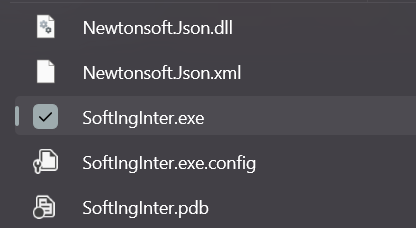
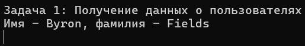
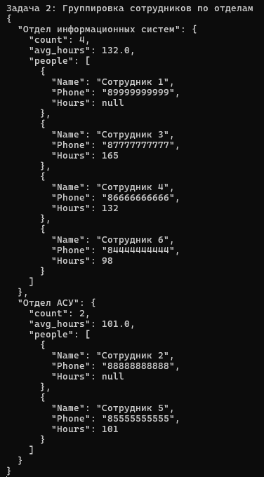

# Задание на практику Soft Engineering (Junior)
## Установка программы.
1. Устанавливаем [Git](https://git-scm.com/), если ранее он не был установлен.
2. Открываем командную строку, выбираем папку (команда `cd "путь_к_папке"`) и при помощи команды `git clone https://github.com/timbilding/SoftIngInter` копируем репозиторий в выбранную папку.
   
Или скачиваем ZIP-файл.

---
## Задача №1
Написать консольное приложение, которое выводит фамилию и имя пользователя с id 10, данные взять из публичного [API](https://reqres.in).

Для запуска программы переходим по пути `SoftIngInter\bin\Debug` и запускаем файл `SoftIngInter.exe`


После запуска сразу начнётся выполнение программы.
##### Результат выполнения


---
## Задача №2
Необходимо сгруппировать сотрудников по отделу из представленного JSON. В каждый отдел необходимо добавить поле count, содержащее количество сотрудников в отделе. В каждый отдел необходимо добавить поле avg_hours, содержащее среднюю выработку сотрудников по отделу. Если у сотрудника отсутствует поле hours, то такого сотрудника необходимо исключить из подсчета средней выработки. 
 
 ### Входной JSON
 ```json [
  {
    "dept": "Отдел информационных систем",
    "name": "Сотрудник 1",
    "phone": "89999999999"
  },
  {
    "dept": "Отдел АСУ",
    "name": "Сотрудник 2",
    "phone": "88888888888"
  },
  {
    "dept": "Отдел информационных систем",
    "name": "Сотрудник 3",
    "hours": 165,
    "phone": "87777777777"
  },
  {
    "dept": "Отдел информационных систем",
    "name": "Сотрудник 4",
    "hours": 132,
    "phone": "86666666666"
  },
  {
    "dept": "Отдел АСУ",
    "name": "Сотрудник 5",
    "hours": 101,
    "phone": "85555555555"
  },
  {
    "dept": "Отдел информационных систем",
    "name": "Сотрудник 6",
    "hours": 98,
    "phone": "84444444444"
  }
]
```
Для выполнения программы в том же файле `SoftIngInter.exe`, после выполнения первой задачи нужно нажать `Enter`. 
##### Результат выполнения


---
## Задача №3
Докеризировать приложение.
Нужно скачать или запустить [Докер](https://www.docker.com/products/docker-desktop/). После чего при момощи комбинации клавиш `Win + r` вызываем диалоговое окно, пишем туда `cmd` и нажимаем `Enter`. Запустится командная строка в которую нужно вписать следующие команды:
   1. `docker pull timbildingg/softint:latest` - данная команда скачает image из репозитория на [`Dockerhub`](https://hub.docker.com/).
   2. `docker run -it --rm timbildingg/softint` - данная команда запустит выполнение двух предыдущих задач в командной строке.
   

